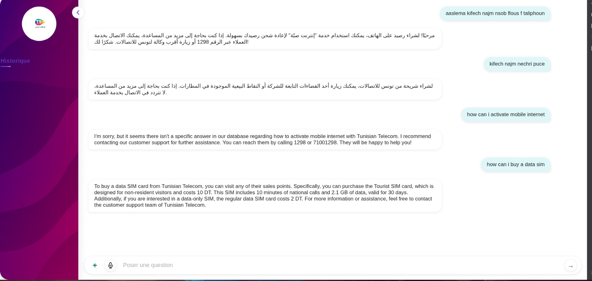

# TT Assistant - AI-Powered Customer Service Chatbot


## Overview

TT Assistant is an intelligent, multilingual customer service chatbot built for Tunisie Telecom. The project was developed during a hackathon focused on creating accessible digital solutions that align with Corporate Social Responsibility (CSR) values.

The chatbot can understand and respond to customer inquiries in multiple languages (French, Arabic, English, and Tunisian dialect) through both text and voice interactions. It improves digital inclusion by removing language barriers and provides fast, reliable answers to common questions.

## Features

- 🌐 **Multilingual Support**: Understands French, Arabic, English, and Tunisian dialect
- 🎤 **Voice Recognition**: Accepts voice input using Whisper AI model
- 🔄 **Text Preprocessing**: Handles typos and unclear questions
- 📱 **Multi-Platform**: Available through web interface and Telegram bot
- 🤖 **AI-Powered**: Uses OpenAI models for natural language understanding
- 🔍 **Knowledge Base**: Connected to a comprehensive FAQ database

## Project Architecture

The system consists of:

1. **Frontend**: Responsive web interface built with HTML, CSS, and JavaScript
2. **Backend**: FastAPI server that processes requests and communicates with the AI models
3. **n8n Workflow**: Orchestrates the AI processing pipeline
4. **AI Agents**: Two-stage processing (preprocessing and answering)
5. **Knowledge Base**: Google Sheets-based FAQ database

### Workflow Overview


1. User input comes through web interface or Telegram
2. First AI agent preprocesses the input and identifies the language
3. Second AI agent finds the relevant answer from the knowledge base
4. Response is sent back to the user in the same format and language

## Demo

### Web Interface




### Telegram Bot


## Knowledge Base

Our FAQ database is available in this [Google Sheet](https://docs.google.com/spreadsheets/d/1CYnQu4ZHmeurehy0tpQ-otsPIDXEkilOkRLFVQ7XviE/edit?gid=355261121#gid=355261121)

## Technologies Used

- **Frontend**: HTML, CSS, JavaScript
- **Backend**: 
  - Python 3.10+
  - FastAPI
  - Whisper AI (voice recognition)
  - gTTS (text-to-speech)
- **AI Processing**: 
  - n8n workflow engine
  - OpenAI GPT models
- **Data Storage**: Google Sheets
- **Bot Platform**: Telegram Bot API

## Installation and Setup

### Prerequisites

- Python 3.10 or higher
- n8n installed and configured
- OpenAI API key
- Google Sheets API access

### Backend Setup

1. Clone the repository
```bash
git clone https://github.com/yourusername/chatbot-tt.git
cd chatbot-tt/backend
```

2. Create and activate a virtual environment
```bash
python -m venv venv
source venv/bin/activate  # On Windows: venv\Scripts\activate
```

3. Install dependencies
```bash
pip install -r requirements.txt
```

4. Start the FastAPI server
```bash
make start  # Runs: uvicorn app:app --reload
```

### n8n Workflow Setup

1. Import the `workflow.json` file into your n8n instance
2. Configure the necessary credentials:
   - OpenAI API key
   - Google Sheets access
   - Telegram bot token (if using the Telegram integration)

3. Activate the workflow

### Environment Variables

Create a `.env` file in the backend directory with the following variables:
```
N8N_URL=http://localhost:5678/webhook/n8n-chatbot
OPENAI_API_KEY=your_openai_api_key
```

## Social Impact

Dans une Tunisie en pleine transition numérique, l'accès équitable à l'information et aux services est un droit fondamental. Pourtant, de nombreux citoyens restent à la marge à cause de barrières linguistiques, géographiques ou culturelles.

Notre réponse : Un chatbot intelligent, vocal et inclusif.

Le développement de notre chatbot s'inscrit pleinement dans la vision d'un service public moderne, accessible et engagé. En facilitant la communication entre Tunisie Telecom et ses usagers, cet outil digital ne se limite pas à un simple support technique : il devient un levier puissant pour renforcer l'image inclusive, sociétale et citoyenne de l'entreprise.

## Team

- FIRAS RIDENE
- NOMO PHILIPPE ANDRE
- LOUAI OUNI
- WILFRIED BONE

Read more about our hackathon experience in this [LinkedIn post](https://www.linkedin.com/posts/firas-ridene_ai-hackathon-csr-activity-7333733843293614081-mq3R)

---

*This project was created as part of a hackathon focused on AI solutions with CSR impact.*
